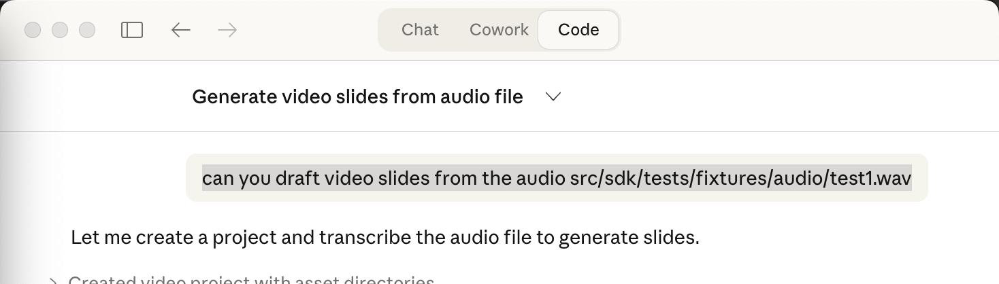
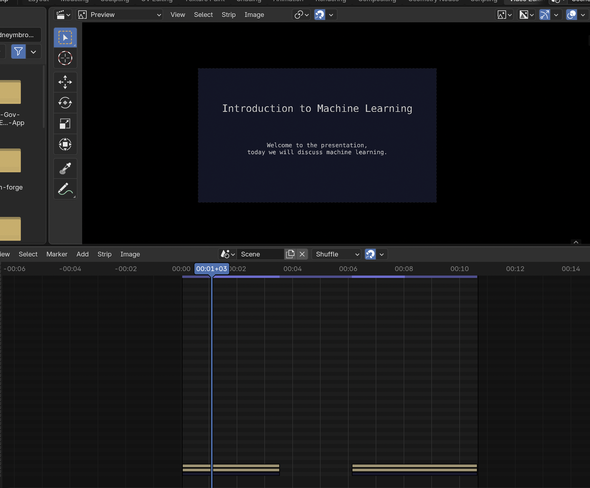
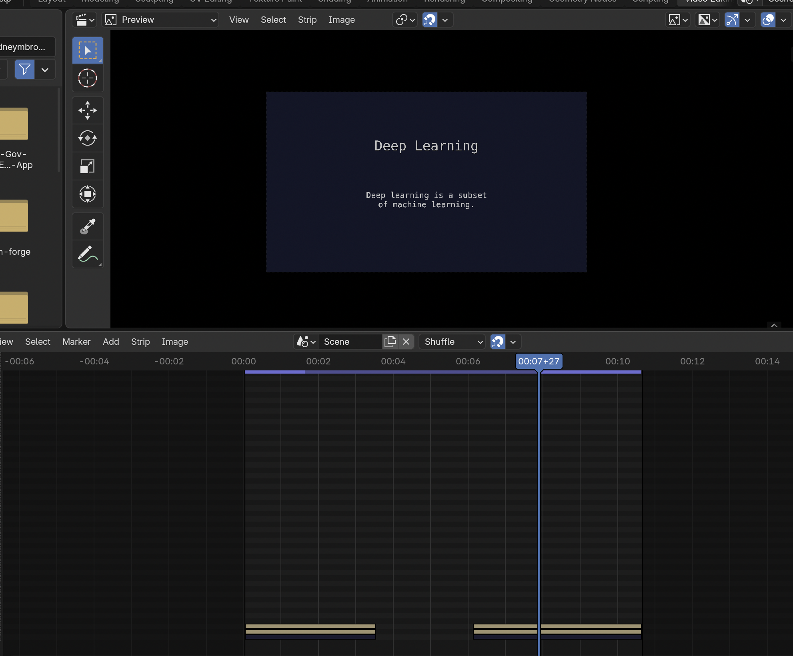
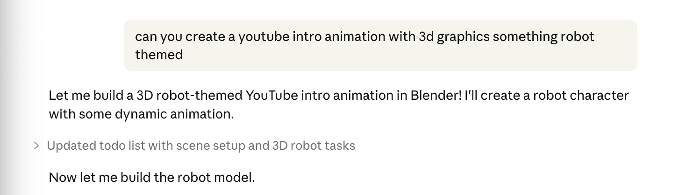
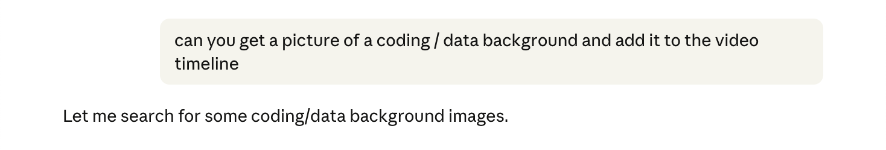

# Video Draft MCP

Content creators spend too much time editing videos. Record your script, and this tool turns your audio into a full video draft — slides, titles, images, transitions — through conversation instead of timeline clicking.

Video Draft MCP is a video editing assistant SDK built on [BlenderMCP](https://github.com/ahujasid/blender-mcp). It connects to Claude through the [Model Context Protocol](https://modelcontextprotocol.io/) and uses Blender's Video Sequence Editor (VSE) for rendering. Because it sits on top of Blender's full Python API, you also get access to 3D effects, motion graphics, and compositing — comparable to Adobe After Effects workflows.

## End-to-End Demo

### 1. Voice to Video

Record your script. The MCP transcribes it with [OpenAI Whisper](https://github.com/openai/whisper) (runs fully offline via [faster-whisper](https://github.com/SYSTRAN/faster-whisper)), detects pauses and sentence boundaries, and scaffolds your entire video as slide frames.

**Audio fixture used:** [`src/sdk/tests/fixtures/audio/test1.wav`](src/sdk/tests/fixtures/audio/test1.wav)

Prompt Claude to create a project and transcribe your audio:



The SDK groups transcript segments into slides using pause detection (>1.5s gap = new slide), sentence boundaries, and duration constraints (3-15s per slide). Claude generates the timeline automatically:





### 2. 3D Video Assets with Blender

Need a YouTube intro, lower third, or motion graphic? Ask Claude. The MCP sends Python directly to Blender's API — 3D text, materials, lighting, camera animation, particle effects, compositing. Comparable to Adobe After Effects for video asset creation.



**Result:** [`src/assets/youtube_intro_draft.mp4`](src/assets/youtube_intro_draft.mp4)

### 3. Web Images with Openverse

Search and pull images from Unsplash, Pexels, and Pixabay directly through conversation. Generate an API key on the spot — instant access, no approval process. Images download straight into your working directory and go into the video timeline or wherever you tell the LLM to put them.



## How It Works

```
You record audio (podcast, script, lecture, etc.)
        |
        v
Whisper transcribes it offline (word-level timestamps)
        |
        v
SDK groups transcript into slides (pause detection, sentence boundaries)
        |
        v
Claude helps you title slides, pick images, set styles
        |
        v
Blender VSE renders the final video
```

1. **Transcribe** — Whisper runs locally (CTranslate2, CPU int8). No API calls, no uploads. Detects pauses and sentence boundaries to automatically segment your audio into slides.

2. **Edit** — Claude sees all your slides and helps you refine them. Add titles, rewrite body text, split or merge slides, reorder sections. Every change is tracked with an undo stack.

3. **Style** — Apply built-in presets (youtube, presentation, cinematic) or set custom fonts, colors, and alignment. Global styles with per-slide overrides.

4. **Image Search** — Search Unsplash, Pexels, and Pixabay for background images. Download and attach to slides directly through conversation. Rate-limited and cached.

5. **3D Assets** — Generate YouTube intros, motion graphics, and video effects through Blender's full Python API. 3D text, materials, lighting, camera animation, particles, compositing.

6. **Render** — Push slides to Blender's VSE. Preview individual frames or export the full video as MP4.

## What Works Today

| Feature | Status |
|---------|--------|
| Audio transcription (Whisper) | Working |
| Slide generation from transcript | Working |
| Slide editing (CRUD, split, merge, reorder) | Working |
| Style presets and customization | Working |
| Image search and download | Working (requires API keys) |
| 3D video assets via Blender | Working (via execute_code) |
| Blender VSE rendering | Working (requires Blender addon) |
| Project management and persistence | Working |
| Undo/redo | Working |

## Roadmap

- **Animations and effects** — Slide transitions, text animations, and 3D overlays via Blender
- **Video scraping** — yt-dlp integration for Creative Commons footage (stubbed)
- **Audio/SFX sourcing** — freesound.org integration for background music (stubbed)

## Installation

### Prerequisites

- Python 3.10+
- [uv](https://docs.astral.sh/uv/) (recommended) or pip
- [Blender](https://www.blender.org/) 3.0+ (for VSE rendering — SDK tools work without it)

### Install

```bash
git clone https://github.com/yourusername/video-draft-mcp.git
cd video-draft-mcp
uv sync
```

### Claude Desktop

Add to your Claude Desktop config (`~/Library/Application Support/Claude/claude_desktop_config.json` on macOS):

```json
{
  "mcpServers": {
    "video-draft-mcp": {
      "command": "uv",
      "args": [
        "--directory",
        "/ABSOLUTE/PATH/TO/video-draft-mcp",
        "run",
        "video-draft-mcp"
      ]
    }
  }
}
```

### Claude Code

```bash
claude mcp add video-draft-mcp -- uv --directory /ABSOLUTE/PATH/TO/video-draft-mcp run video-draft-mcp
```

### Blender Addon

1. Open Blender
2. Edit > Preferences > Add-ons > Install
3. Select `addon.py` from this repo
4. Enable "VideoDraftMCP"
5. In the 3D Viewport sidebar, open the VideoDraftMCP panel and click Connect

The addon runs a socket server on `localhost:9876`. The MCP server connects to it automatically when Blender is running.

## Image Search Setup

Image search uses free API tiers. Generate a key on any of these platforms — instant access, no approval wait:

| Variable | Source | Free Tier |
|----------|--------|-----------|
| `UNSPLASH_API_KEY` | [Unsplash Developers](https://unsplash.com/developers) | 50 requests/hour |
| `PEXELS_API_KEY` | [Pexels API](https://www.pexels.com/api/) | 200 requests/hour |
| `PIXABAY_API_KEY` | [Pixabay API](https://pixabay.com/api/docs/) | 100 requests/minute |

All three are optional. The SDK rotates through whichever sources are configured.

## Architecture

```
src/
  sdk/
    core/
      slides/           # Slide data models (Pydantic) — styles, animations, templates
      workspace.py      # Project directory and asset management
      state.py          # Session state, undo stack, style presets
    intake/
      audio.py          # faster-whisper transcription
    webscraping/
      images.py         # Unsplash/Pexels/Pixabay search
  blender_mcp/
    server.py           # MCP server (29 tools)
addon.py                # Blender addon (VSE rendering, socket server)
```

The SDK is pure Python — no Blender dependency. Blender is only used for final rendering through the addon's socket connection.

## Running Tests

```bash
uv run pytest
```

Tests cover slide models, workspace management, session state, audio transcription (with real Whisper model), and image search (mocked APIs). The e2e audio tests use a WAV fixture and run actual transcription.

## Forked From

This project is forked from [BlenderMCP](https://github.com/ahujasid/blender-mcp) by [@ahujasid](https://github.com/ahujasid). The original project connects Blender to Claude AI through MCP for 3D modeling and scene creation. This fork retains the core Blender socket connection and adds the Video Draft SDK on top of it.

## License

MIT
